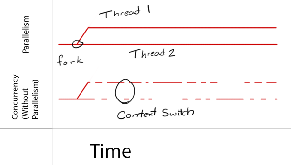

#Think in concurrency

##概念 concepts

###并发与并行 Concurrency vs Parallelism
并发代码的不同部分可以“同步”执行。然而，该怎样发生或是否发生都取决于系统。多核设备通过并行来同时执行多个线程；然而，为了使单核设备也能实现这一点，它们必须先运行一个线程，执行一个上下文切换，然后运行另一个线程或进程。这通常发生地足够快以致给我们并发执行地错觉。

所以区别他们最重要的一点就是看，物理层面上，他们是不是真正地同时发生的。

###上下文切换 Context Switch
这个术语在上图中出现了。一个上下文切换指当你在单个进程里切换执行不同的线程时存储与恢复执行状态的过程。这个过程在编写多任务应用时很普遍，但会带来一些额外的开销。

###线程安全 Thread Safe
线程安全的代码能在多线程或并发任务中被安全的调用，而不会导致任何问题（数据损坏，崩溃，等）。线程不安全的代码在某个时刻只能在一个上下文中运行。换句话说，__线程安全的代码，在多线程中运行和在单线程中运行，效果是一样的。__

##iOS GCD

###并发队列 Concurrent Queues
iOS的GCD中，总共有以下几种队列。

+ 主队列 Main Queue
+ 全局调度队列 Global Dispatch Queues
+ 自定义队列 Custome Queue

主队列能保证所有的任务都在主线程执行，而主线程是唯一可用于更新 UI 的线程。而全局调度队列共四个，对应不同的优先级

+ background
+ low
+ default
+ high

###dispatch_async
dispatch_async把一个块添加到一个队列，然后就立即返回，不再管执行的情况。基本上就是“提起裤子就走人”的情况。

	//Code Group 1
	dispatch_async(dispatch_get_global_queue(DISPATCH_QUEUE_PRIORITY_HIGH, 0), ^{ 
		//Code Block 2
        //Do something heavy work background avoiding choking
        dispatch_async(dispatch_get_main_queue(), ^{
        	//Code Block 3
            //Go back to Main Queue to refresh the UI
        }); 
    }); 
    
###dispatch_sync
dispatch_sync() 同步地提交工作并在返回前等待它完成。
    
###dispatch_after
dispatch_after用来实现延时，指定一个`dispatch_time_t`类型的延迟时长，在指定Queue中添加一个块。一般都是把它应用在主线程上。

	double delayInSeconds = 1.0; 
    dispatch_time_t popTime = dispatch_time(DISPATCH_TIME_NOW, (int64_t)(delayInSeconds * NSEC_PER_SEC)); // NSEC意思是Nano Second 
    dispatch_after(popTime, dispatch_get_main_queue(), ^(void){  
        //What you want to do after the timelapse
    }); 
    
    
    
###dispatch_once
dispatch_once以线程安全的方式执行且仅执行其代码块一次。试图访问临界区（即传递给 dispatch_once 的代码）的不同的线程会在临界区已有一个线程的情况下被阻塞，直到临界区完成为止。这个最常见的就是用来实现单例了。注意需要传一个`dispatch_once_t`参数

	static KMUserModel *sharedInstance = nil;
    static dispatch_once_t onceToken;
    dispatch_once(&onceToken, ^{
        sharedInstance = [[KMUserModel alloc] init];
    });
    return sharedInstance;
    
###Dispatch barriers
Dispatch barriers 是一组函数，在并发队列上工作时扮演一个串行式的瓶颈。通常用来解决读者写者问题。一张图说明一切。

Dispatch barriers最好用在自定义并发队列。

	//一般queue是作为property的
	dispatch_queue_t concurrentQueue;
	concurrentQueue = dispatch_queue_create("com.someName",DISPATCH_QUEUE_CONCURRENT);  
	dispatch_barrier_async(self.concurrentQueue, ^{ 
    	//线程安全地读写操作 
        dispatch_async(dispatch_get_main_queue(), ^{
            //回到主线程  
        }); 
    }); 
    

#.Net Multithread
###Task
不妨直接看代码

	static void Main(string[] args)
	{
		Console.WriteLine("主线程启动");
            
		//.NET 4.5引入了Task.Run静态方法来启动一个线程
		Task.Run(() => { Thread.Sleep(1000); Console.WriteLine("Task1启动"); });

		//Task启动的是后台线程，假如要在主线程中等待后台线程执行完毕，可以调用Wait方法
		Task task = Task.Run(() => { Thread.Sleep(500); Console.WriteLine("Task2启动"); });
		task.Wait();
            
		Console.WriteLine("主线程结束");
	}

Task启动的线程是后台线程，不过可以通过在Main方法中调用task.Wait()方法，使应用程序等待task执行完毕。Task底层是使用线程池的。线程的创建和销毁是一个开销比较大的操作，Task.Run()每次执行将不会立即创建一个新线程，而是到CLR线程池查看是否有空闲的线程，有的话就取一个线程处理这个请求，处理完请求后再把线程放回线程池，这个线程也不会立即撤销，而是设置为空闲状态，可供线程池再次调度，从而减少开销。

它的加强版是Task<TResult>，这是Task的泛型版本，这两个之间的最大不同是Task<TResult>可以有一个返回值。

            Task<string> task = Task<string>.Run(() => { Thread.Sleep(1000); return Thread.CurrentThread.ManagedThreadId.ToString(); });
            Console.WriteLine(task.Result);
            
Task<TResult>的实例对象有一个Result属性，当在Main方法中调用task.Result的时候，将等待task执行完毕并得到返回值，这里的效果跟调用task.Wait()是一样的，只是多了一个返回值。

###async and await
async用来修饰方法，表明这个方法是异步的，声明的方法的返回类型必须为：void或Task或Task<TResult>。返回类型为Task的异步方法中无需使用return返回值，而返回类型为Task<TResult>的异步方法中必须使用return返回一个TResult的值.

await必须用来修饰Task或Task<TResult>，而且只能出现在已经用async关键字修饰的异步方法中。

通常情况下，async/await必须成对出现才有意义，假如一个方法声明为async，但却没有使用await关键字，则这个方法在执行的时候就被当作同步方法，这时编译器也会抛出警告提示async修饰的方法中没有使用await，将被作为同步方法使用。

async关键字表明可以在方法内部使用await关键字，方法在执行到await前都是同步执行的，运行到await处就会挂起，并返回到Main方法中，直到await标记的Task执行完毕，才唤醒回到await点上，继续向下执行。

###Lock语句
尽管都是用来做线程同步的，而且明明上也容易让人联系到Dispatch barriers。但是Lock的功能跟Dispatch barriers并不一样。lock 关键字将语句块标记为临界区，方法是获取给定对象的互斥锁，执行语句，然后释放该锁。也就是一段代码，不会被同时在两个线程中执行。Lock的形式如下：

	lock(obj)
	{
	//锁定运行的代码段
	}
	
注意到，lock要指定一个锁住的对象，这必须是引用类型的。lock(this)只对当前对象有效，如果多个对象之间就达不到同步的效果。如果你想保护一个类的实例，一般地，你可以使用this <del>虽然对于public对象容易导致错误</del>；如果你想保护一个静态变量（如互斥代码段在一个静态方法内部），一般使用类名就可以了。

由于一些特殊的原理，lock不宜用于值类型、字符串、typeof(Class)。最推荐的是`private static readonly object`。
        
#参考
+ [Grand Central Dispatch In-Depth 中文译本](http://www.cocoachina.com/industry/20140515/8433.html "Grand Central Dispatch In-Depth")

+ [线程同步 MSDN](http://msdn.microsoft.com/zh-cn/library/ms173179.aspx "线程同步 MSDN参考")