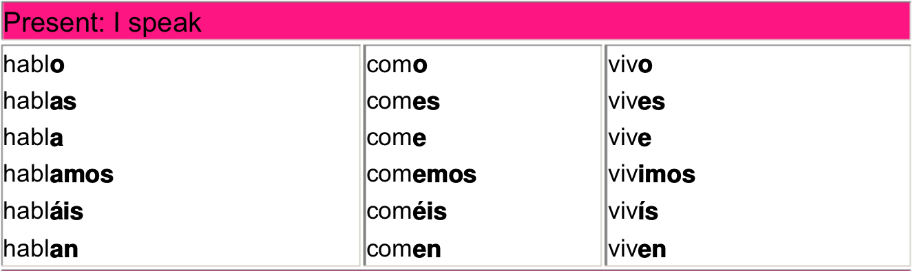

##基本打招呼
+ ¿Qué tal?
+ ¿Cómo estás?
+ ¡Buenos días!
+ ¡Buenas tardes!
+ ¡Buenas noches!
+ ¡Mucho gusto!

##基本信息询问和回答
以下询问的你（te）和你的（tu）都可以用第三人称代替(se y su)，相当于用了usted

+ ¿Cómo te llamas?
+ Me llamo ~~Desmond~~
+ ¿Cuál es tu apellido?
+ Mi apellido es ~~Zhong~~
+ ¿A que se dedica usted？
+ _(直译是您把自己献给了什么，What do you devote yourself to)_
+ Soy ~~un estudiente de infomatión~~
+ ¿Cuantos años tienes?
+ Tengo ~~veinte años~~
+ ¿Dónde vive?
+ Vivo en ~~Pekín~~
+ ¿Es usted casado?
+ No, soy soltero.

## 数字

+ 0 cero
+ 1 uno
+ 2 dos
+ 3 tres
+ 4 cuatro
+ 5 cinco
+ 6 seis
+ 7 siete
+ 8 ocho
+ 9 nueve
+ 10 diez
+ 11 once
+ 12 doce
+ 13 trece
+ 14 catorce
+ 15 quince
+ 15+ dieci...
+ 16 dieciséis
+ 17 diecisiete
+ 18 dieciocho
+ 19 diecinueve
+ 20 veinte
+ 20+ veinti...
+ 30 treinta
+ 40 cuarenta
+ 50 cincuenta
+ 60 sesenta
+ 70 setenta
+ 80 ochenta
+ 90 noventa

##名词
__颜色__

¿De qué color es esto?

+ blanco 白色
+ rojo 红色
+ naranja 橙色
+ amarillo 黄色
+ verde 绿色
+ azul 蓝色
+ negro 黑色
+ gris 灰色
+ rosa 粉红色

__身体__

+ ojo 	眼睛
+ pelo cabello 头发
+ bigote 髯

__衣服__

+ jersey 长袖t桖
+ camiseta T-shirt
+ zapatos 鞋子
+ chaqueta 夹克
+ pantalones 裤子
+ zapatillas 运动鞋
+ camisa 衬衣

__亲戚__

+ abuelo 祖父
+ padre madre 父母
+ suegro 岳父
+ tío 叔叔
+ novio 男朋友
+ esposo 丈夫
+ hermano 兄弟
+ primo 堂兄弟
+ cuñado 连襟
+ hijo 儿子
+ yerno/nuera 女婿，儿媳
+ sobrino 侄子
+ nieto 孙子

##动词

|动词原形|释义|
|----|------|
|ver|看见|
|trabajar|工作|
|viver|生存居住|
|ser|是|
|estar|在，处于|
|decir|讲，说|
|dedicar|献出|
|tener|拥有|

##动词变位
-ar -or -ir

##特殊动词变位
仅包括现在陈述式

|Infinitivo|Yo|Tú|Él Ella Usted|Nosotros|Vosotros|Ellos Ellas Ustedes|
|----------|--|--|-------------|--------|--------|-------------------|
|estar|estoy|estás|está|||están|
|ser|soy|eres|es|somos|sois|son|
|decir|digo||||||
|tener|tengo||||||
